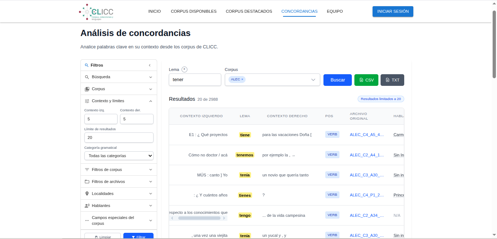
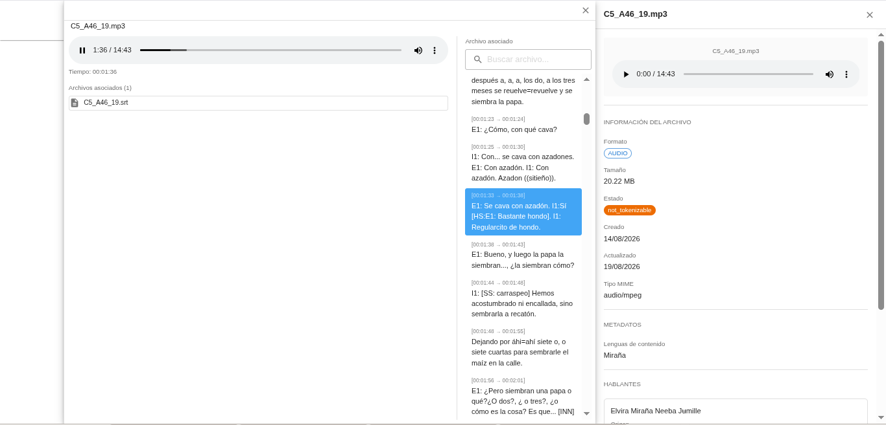

## Descripción

[**CLICC**](https://clicc.caroycuervo.gov.co/) es una plataforma de software para la gestión, procesamiento y análisis de corpus lingüísticos desarrollada para el [Instituto Caro y Cuervo](https://www.caroycuervo.gov.co/). Permite a investigadores subir textos, tokenizarlos automáticamente, buscar palabras clave y generar concordancias ( KWIC - Key Word In Context) sobre uno o múltiples corpus de forma simultanea.

El sistema procesa textos en tres formatos de entrada (texto plano, CoNLL-U y TEI XML), almacena los tokens con anotaciones lingüísticas completas (lema, POS, dependencias) y ofrece una interfaz web moderna para realizar búsquedas avanzadas con contexto configurable.

*Sistema de busqueda de concordancias.*

*Sistema de archivos multimedia alineados.*
## Tecnologías

- **Next.js 15** (frontend)
- **NestJS** (backend API)
- **React 19** + **MUI** (interfaz de usuario)
- **MongoDB** (almacenamiento)
- **FFmpeg** (conversion de videos)
- **TipTap** (editor de texto enriquecido)
- **Zustand** (gestión de estado)
- **TypeScript** + **Zod** (validación)
- **Tailwind CSS** + **Emotion** (estilos)

## Lo que hice

- Desarrollé el **frontend completo en Next.js** con arquitectura de layouts, autenticación, registro de usuarios y confirmación de email
- Implementé el **dashboard de corpus** con tabla virtualizada, subida de archivos y gestión de metadatos geográficos (GeoJSON)
- Construí la interfaz de **búsquedas KWIC** con contexto configurable (izquierdo/derecho), paginación y combinación de resultados multi-corpus
- Implementé el **sistema de tokenización** con estrategias por formato: texto plano (UDPipe/local), CoNLL-U (importación directa) y TEI XML (preservación de anotaciones)
- Desarrollé el **backend NestJS** con arquitectura modular: módulos de corpus, archivos, tokens, autenticación, usuarios, idiomas, localización y correo
- Desarrollé un **microservicio de email** independiente con Express y MongoDB como cola de mensajes, worker asíncrono con reintentos, lease-based duplicate prevention y envío SMTP via Office 365
- Optimicé las consultas de MongoDB con índices estratégicos y inserciones en lotes de 10.000 tokens para altas prestaciones
- Integré **FFmpeg** para la conversión automática de videos MOV a MP4 con diálogo de confirmación al usuario
- Configuré el despliegue con PM2/Nginx en producción (HTTPS, reverse proxy, variables de entorno embebidas en build)
- Implementé migraciones de datos legacy para corpus, speakers y archivos
- Agregué tests unitarios con Vitest para el backend y Testing Library para el frontend

## Arquitectura

```
clicc-25/          (Frontend - Next.js)
  └── src/
      ├── app/      (rutas: auth, corpus, home, KWIC, concordancias)
      ├── components/(interfaz reusable, tablas, formularios)
      ├── services/ (cliente API, tokenización)
      ├── stores/   (estado global con Zustand)
      └── hooks/    (hooks personalizados)

clicc-backend/     (Backend - NestJS)
  └── src/
      ├── tokenization/ (KWIC, concordancias, procesamiento de archivos)
      ├── corpus/       (gestión de corpus y archivos)
      ├── auth/         (JWT, registro, confirmación de email)
      ├── user/         (CRUD de usuarios)
      ├── speaker/      (gestión de oradores)
      ├── location/     (ubicaciones geográficas)
      └── files/        (subida y conversión de archivos)
```
